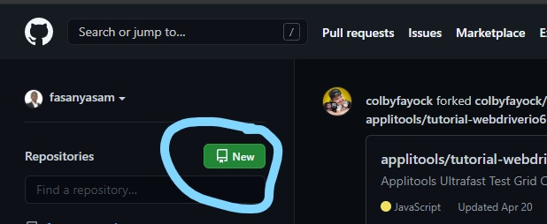
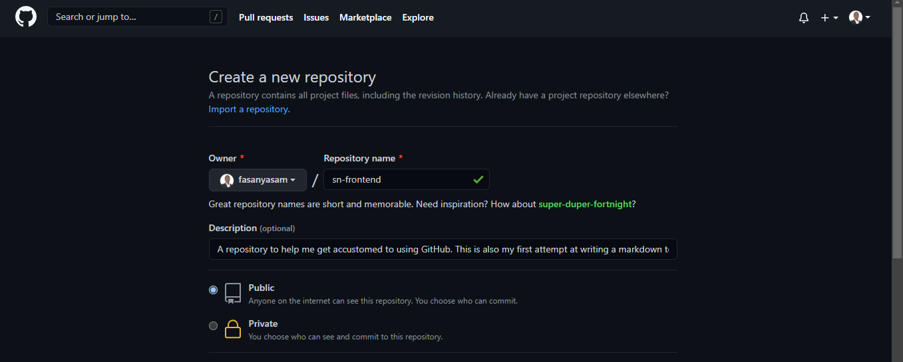
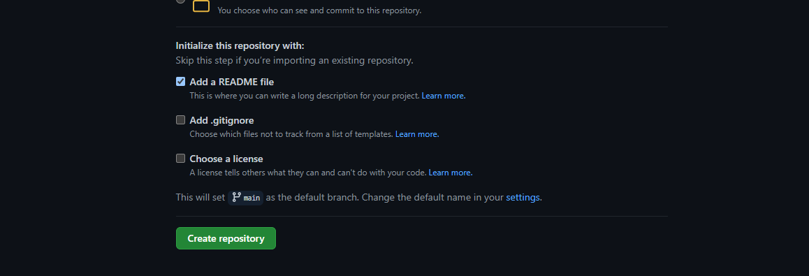

# PUSHING FILES TO GITHUB 
This is a guide on how to push a files to Github. This guide will take use the examole of a markdown text file.  
The procedure will be broken down into the following steps: 
1. Create first-assignment folder with a text file assignment.md
2. Create a Github repository 
3. Push folder to Github using Git bash (commandline).  
## Create and Save a Text File:  
Text files can be created with any text editor like Notepad, Notepad++, Sublime text, Visual Studio Code and lots more. The text file in this example is a Markdown text file which is save with the .md file extension (i.e textfile.md). 
To create your text file open your text editor and save the text file as 'assignment.md' in a folder named first-assignment. 
## Create a Github Repository
To create a Github repository, note that you must have signed up and have an existing account on github.com and you must also be logged in. 
- Click on the 'New" icon as shown below 
. 
- Fill the field shown below 
. 
The repository name should not have space in-between. If added, it would automatically be replaced with "-" symbol.  
There should be a description giving a background story or an insight to the content of the repository.
Choose whether it should be a Public repository(i.e visible to others) or Private (i.e visible to you alone). 

You can choose to add a Readme.md File which will contain what you have filled in the description above. 
Alternatively (which I recommnend) you can chosse not to add a Readme file yet.  
(**Note: Whatever is written in the description box will not be saved there again. A ReadMe.md file can be added afterwards** )  
Then you can create a repository.
If you choose to not create a ReadMe file, you would be staring at a screen that carries the necessary commands for you to follow .  
## Push folder to Github using Git bash (commandline)
To do this successfully you need to have installed GitBash command line on your PC.
Open GitBash and navigate to your project folder or right-click inside the GitHub project and select "GitBash here" to open GitBash while working from that directory.  
Enter the following commands:  
> git init   
> git add *  

This stages everything in the folder and subfolders  
> git commit -m "commit message"  

This applies the changes.  
If this is your first time using GitBash you will need to set your name and email  
> git config --global user.name "John Doe"  
> git config --global user.email johndoe@example.com  
> git remote add origin <git repository link ending with .git>  
> git push -u origin master  
Reload the page 
**Congratulations on your first push to GitHub**

